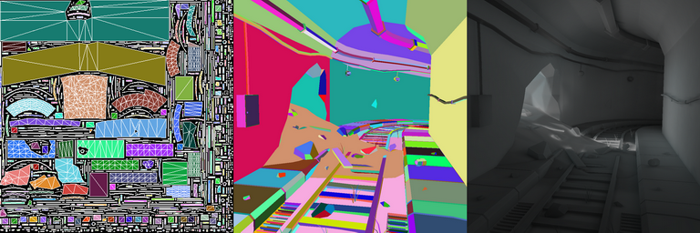

xatlas-rs
========
[](https://travis-ci.com/Jasper-Bekkers/xatlas-rs)
[](https://crates.io/crates/xatlas-rs)
[](https://docs.rs/xatlas-rs)
[](https://github.com/Jasper-Bekkers/xatlas-rs)


This crate is a wrapper around the [xatlas](https://github.com/jpcy/xatlas) library.

A cleaned up version of [thekla_atlas](https://github.com/Thekla/thekla_atlas).

Mesh charting, parameterization and atlas packing. Suitable for generating unique texture coordinates for baking lightmaps.

- [Documentation](https://docs.rs/xatlas-rs)



## Usage

Add this to your `Cargo.toml`:

```toml
[dependencies]
xatlas-rs = "0.1.3"
```

## License

Licensed under MIT license (http://opensource.org/licenses/MIT)

## Contribution

Unless you explicitly state otherwise, any contribution intentionally submitted
for inclusion in this crate by you, shall be licensed as above, without any additional terms or conditions.

Contributions are always welcome; please look at the [issue tracker](https://github.com/Jasper-Bekkers/xatlas-rs/issues) to see what known improvements are documented.
